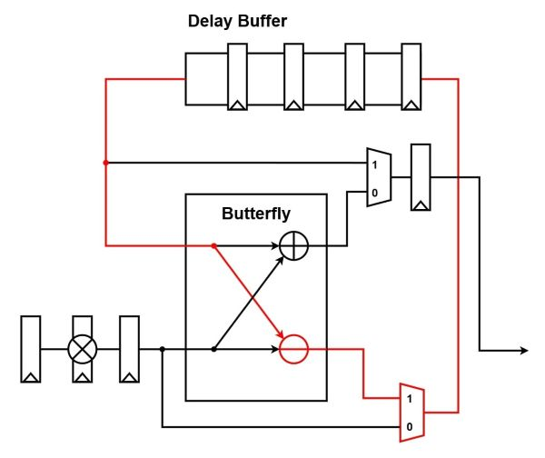

# FFT

> [!NOTE]  
> See source code [fft.c](/software/fft.c#L171) at line 171-300.


``` verilog
module FFT #(
    parameter   FLOAT_PRECISION = 64,
    parameter   logn = 8
)(
    // Input signals
    clk,
    rst_n,
    in_valid,
    fi_re, fi_im,
    s_re_1, s_im_1,
    s_re_2, s_im_2,
    s_re_3, s_im_3,
    s_re_4, s_im_4,
    s_re_5, s_im_5,
    s_re_6, s_im_6,
    s_re_7, s_im_7,
    s_re_8, s_im_8,
    // Output signals
    out_valid,
    tw_idx_1, 
    tw_idx_2, 
    tw_idx_3,
    tw_idx_4,
    tw_idx_5,
    tw_idx_6,
    tw_idx_7,
    tw_idx_8,
    fo_re, fo_im
);
```

## Description
Current FFT implement radix-2 unit in a stage (critical path marked as red line).
|                                                       |
|:-:                                                    | 
|                 | 
| Radix-2 Unit                                          |
|  | 
| FFT Data Path                                         |

## Latency
|           | radix-2   |
|:---:      |:---:      |
| **CYCLE** | 280       |

## Performance
|               | 40nm          | 90nm  |       |
|:---:          |:---:          |:---:  |:---:  |
| **Period**    | 2.1ns         |       |       |
| **#GATE**     | 93498         |       |       |
| **AREA**      | 933035.222337 |       |       |

## Future Optimization
1. optimize critical path
2. adopt radix- $2^2$ or radix- $2^3$
2. Self written fpu instead of designware.

> [!WARNING]  
> `rst_n` has timing violation.