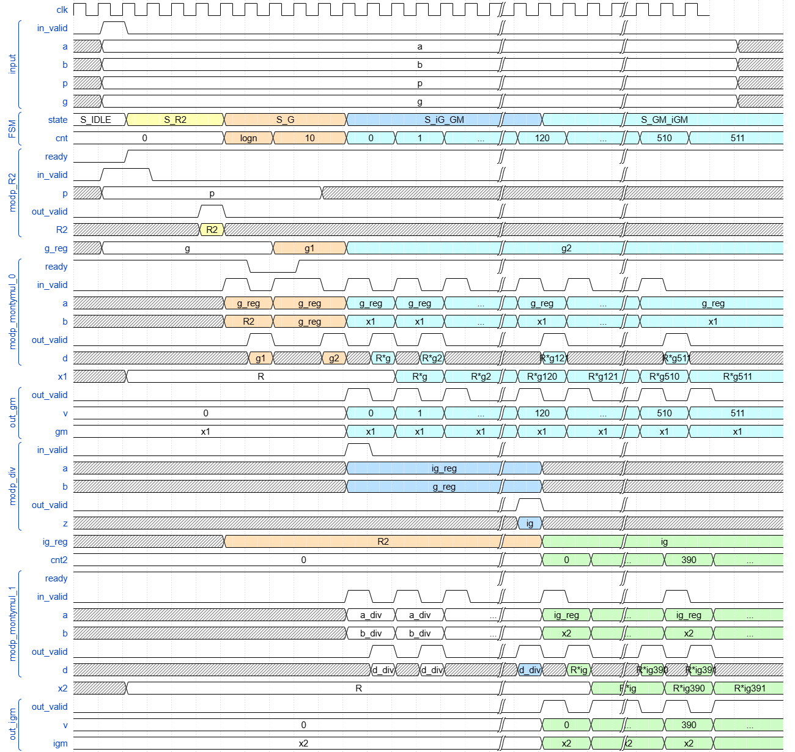

# MODP_MKGM2

> [!NOTE]  
> See source code [keygen.c](/software/keygen.c#L943) at line 943-977.

```verilog
module MODP_MKGM2 (
    // Main channel
    // Input signals
    clk,
    rst_n,
    in_valid,
    logn,
    g,
    p,
    p0i,
    mode,
    // Output signals
    out_valid_gm,
    v_gm,
    gm,
    out_valid_igm,
    v_igm,
    igm,
    // MODP_MONTYMUL_TOP
    // Input signals
    out_valid_modp_montymul_bus,
    d_modp_montymul_bus,
    ready_modp_montymul_bus,
    // Output signals
    in_valid_modp_montymul_bus,
    a_modp_montymul_bus,
    b_modp_montymul_bus,
    p_modp_montymul_bus,
    p0i_modp_montymul_bus,
    isMQ_modp_montymul_bus,
    // MODP_R2_TOP
    // Input signals
    out_valid_modp_R2,
    R2_modp_R2,
    ready_modp_R2,
    // Output signals
    in_valid_modp_R2,
    p_modp_R2,
    p0i_modp_R2
);
```

## Description

The `MODP_MKGM2` generate roots for NTT and inverse NTT, `gm` and `igm`, respectively. There are 3 modes that computes both `gm` and `igm` at the same or only one of them:

| `mode` |     `0`      |    `1`    |    `2`     |
| :----: | :----------: | :-------: | :--------: |
|        | `gm` & `igm` | only `gm` | only `igm` |

Because `MODP_MKGM2` is piplined in 2 stages, the calculation of `gm` and `igm` can be done one by one, as shown in the figure below.



## Latency

With sufficient hardware, 2 `MODP_MONTYMUL` and 1 `MODP_R2`, the latency of `gm` and `igm` are shown below. The cycles range from the 1st produced to the last.

| `logn` |   `gm`    |   `igm`    |
| :----: | :-------: | :--------: |
|   9    | 16 ~ 1038 | 144 ~ 1166 |
|   8    | 18 ~ 528  | 146 ~ 656  |
|   7    | 20 ~ 274  | 148 ~ 422  |


## Performance

|            |     40nm     |
| :--------: | :----------: |
| **Period** |    2.0ns     |
| **#GATE**  |     3641     |
|  **AREA**  | 36334.266660 |

## Future Optimization

1. Output of `MODP_R2` is registered. Maybe output directly.
2. Some register in MODP_DIV can merge to `MODP_MKGM2`.
