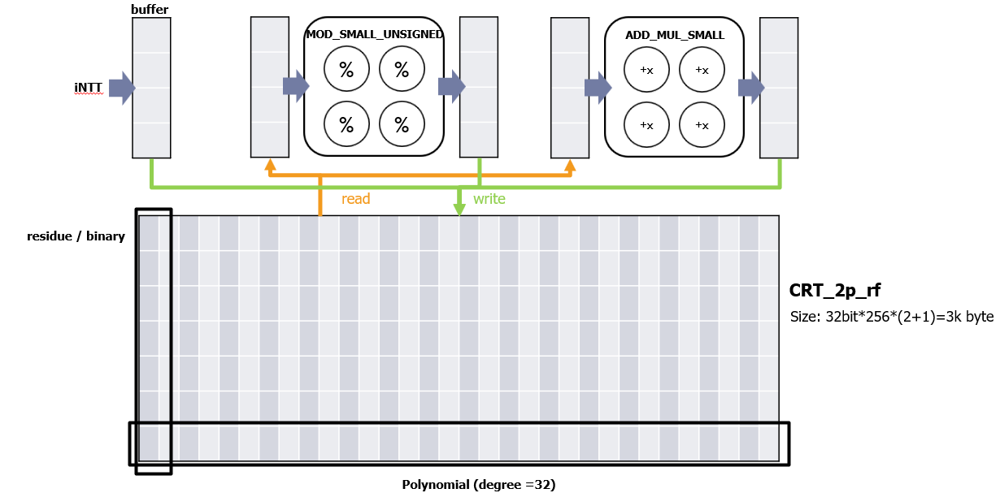
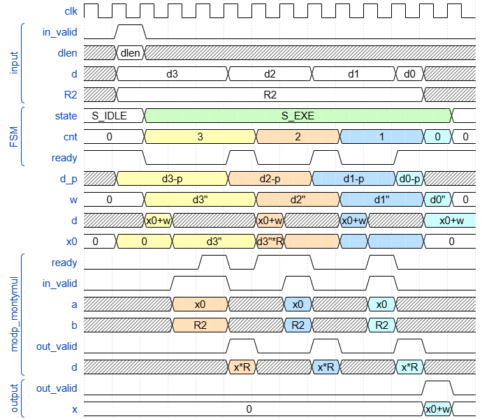

# ZINT_REBUILD_CRT

> [!NOTE]  
> See source code [keygen.c](/software/keygen.c#L1355) at line 1355-1416.

```verilog
module ZINT_REBUILD_CRT (
    // Main channel
    // Input signals
    clk,
    rst_n,
    in_valid,
    len_valid,
    mode,
    inf_logn,
    num,
    logn,
    xlen,
    input_ptr,
    intt_output_buffer_comb,
    // Output signals
    out_valid,
    // MODP_MONTYMUL_TOP
    modp_montymul_req,
    modp_montymul_resp,
    // RF_CRT
    is_write,
    is_read,
    CENB_comb, 
    AB_comb, 
    DB_comb,
    CENA, 
    AA, 
    QA
);
```

## Description
`ZINT_REBUILD_CRT` consist 2 main operations: `ZINT_MOD_SMALL_UNSIGNED` and `ZINT_ADD_MUL_SMALL`. Due to dataflow, the hardware requires a registerfile `RF_2p_CRT` to store temp data, which is shared with other modules in `MAKE_FG`. The read / write operations are controlled by pointers `mod_small_unsigned_ptr`, `add_mul_small_ptr`.




### Inputs

* `mode` : **FALCON-512** / **FALCON-1024** select signal, defined with `FALCON_MODE`.
* `logn` : degree of input polynomials
* `num` : $2^{logn}$
* `xlen` : number of input polynomials
* `input_ptr` : intt output counter
* `intt_output_buffer_comb` : intt output buffer data, act as input data

## Outputs
* `out_valid`

<!--  -->


## Performance

| `WORD_NUM` |   2    |   4    |   8    |
| :--------: | :----: | :----: | :----: |
| **Period** | 1.48ns | 1.55ns | 1.65ns |
| **#GATE**  | 225975 | 299151 | 513374 |
| **Cycle**  | 16.74M | 12.57M | 11.48M |

## Future Optimization

1. Maybe 1st round `ZINT_MOD_SMALL_UNSIGNED` can skip.
2. `PRIME` LUT instance can be merged.
